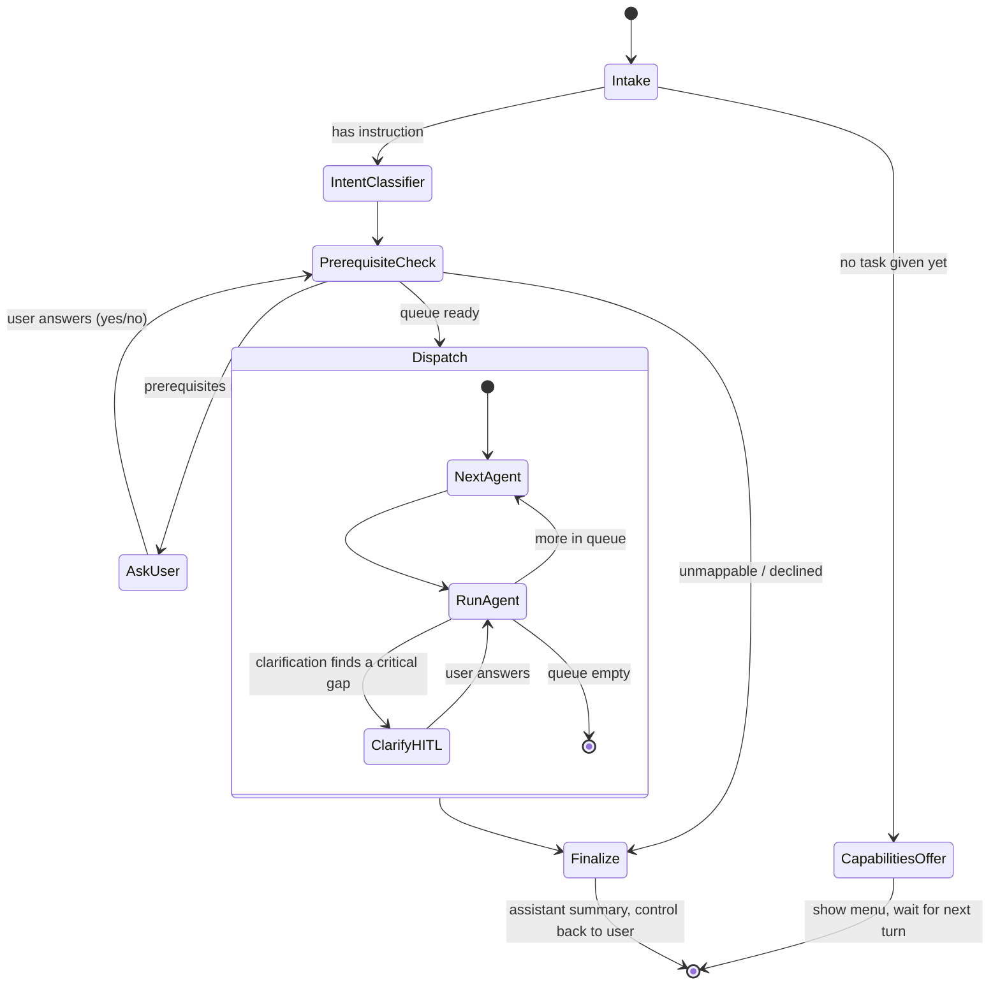

# Agent flow map (intent-driven)

One graph invocation = one user turn. The Manager classifies intent and only the needed agents
run; missing prerequisites are confirmed with the user first.

Agents reachable in `Dispatch` (run only when the intent needs them, in dependency order):
`transcription` (audio only), `requirement`, `clarification`, `planning`, `task_generation`,
`risk`, `proposal`, `validator`, `executor`.
