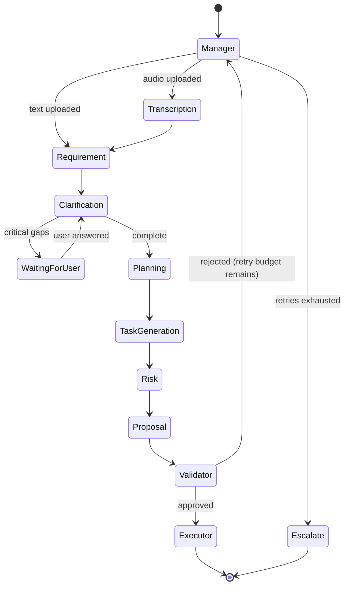

# Agent flow map

```mermaid
stateDiagram-v2
    [*] --> Manager
    Manager --> Transcription: audio uploaded
    Manager --> Requirement: text uploaded
    Transcription --> Requirement
    Requirement --> Clarification
    Clarification --> WaitingForUser: critical gaps
    WaitingForUser --> Clarification: user answered
    Clarification --> Planning: complete
    Planning --> TaskGeneration
    TaskGeneration --> Risk
    Risk --> Proposal
    Proposal --> Validator
    Validator --> Executor: approved
    Validator --> Manager: rejected (retry budget remains)
    Manager --> Escalate: retries exhausted
    Executor --> [*]
    Escalate --> [*]
```
