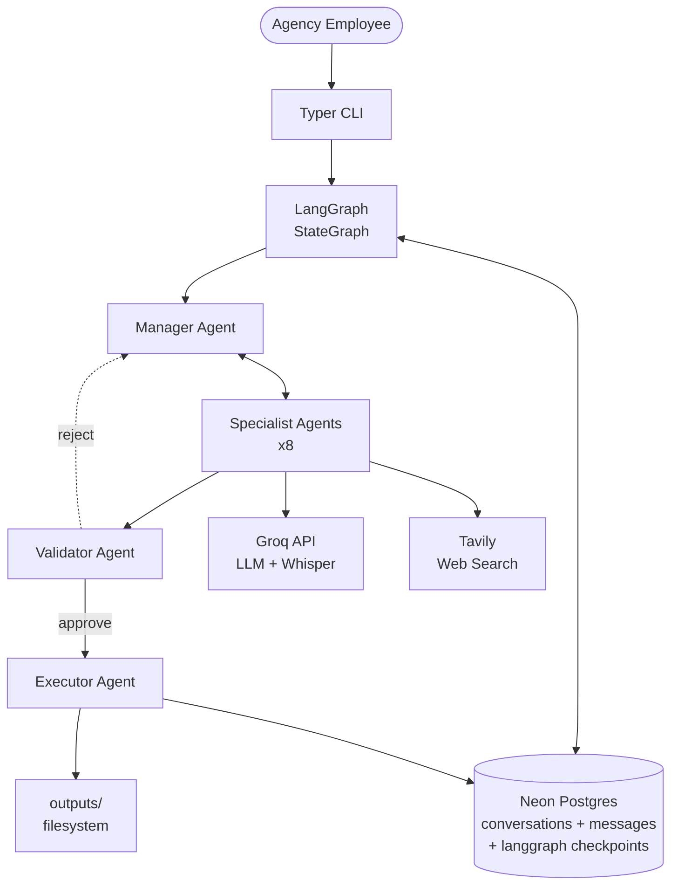

# Architecture diagram

```mermaid
flowchart TB
    User([Agency Employee])
    CLI[Typer CLI]
    Graph[LangGraph<br/>StateGraph]
    Manager[Manager Agent]
    Specialists[Specialist Agents<br/>x8]
    Validator[Validator Agent]
    Executor[Executor Agent]
    PG[(Neon Postgres<br/>conversations + messages<br/>+ langgraph checkpoints)]
    Groq[Groq API<br/>LLM + Whisper]
    Tavily[Tavily<br/>Web Search]
    FS[outputs/<br/>filesystem]

    User --> CLI --> Graph
    Graph --> Manager
    Manager <--> Specialists
    Specialists --> Validator
    Validator -->|approve| Executor
    Validator -.->|reject| Manager
    Specialists --> Groq
    Specialists --> Tavily
    Graph <--> PG
    Executor --> FS
    Executor --> PG
```

(See ARCHITECTURE.md for the complete specification.)
