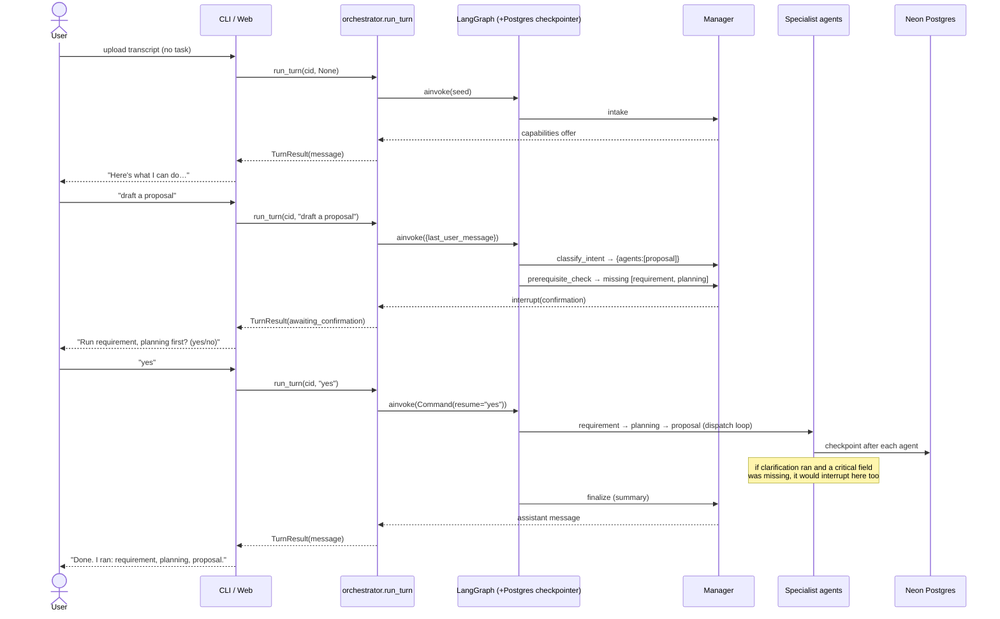

# Sequence diagram — a conversational session

Each user message is one `run_turn`. The graph runs only the agents the intent needs; the
checkpointer persists state between turns. Two interrupt types are shown: prerequisite
confirmation and clarification HITL.

