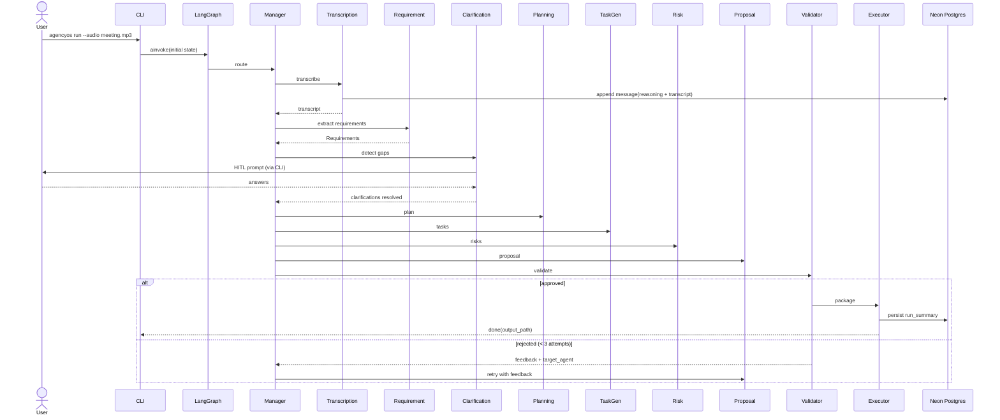

# Sequence diagram — one end-to-end run

```mermaid
sequenceDiagram
    actor U as User
    participant CLI
    participant G as LangGraph
    participant M as Manager
    participant T as Transcription
    participant R as Requirement
    participant C as Clarification
    participant P as Planning
    participant TG as TaskGen
    participant Rk as Risk
    participant Pr as Proposal
    participant V as Validator
    participant E as Executor
    participant DB as Neon Postgres

    U->>CLI: agencyos run --audio meeting.mp3
    CLI->>G: ainvoke(initial state)
    G->>M: route
    M->>T: transcribe
    T->>DB: append message(reasoning + transcript)
    T-->>M: transcript
    M->>R: extract requirements
    R-->>M: Requirements
    M->>C: detect gaps
    C->>U: HITL prompt (via CLI)
    U-->>C: answers
    C-->>M: clarifications resolved
    M->>P: plan
    M->>TG: tasks
    M->>Rk: risks
    M->>Pr: proposal
    M->>V: validate
    alt approved
        V->>E: package
        E->>DB: persist run_summary
        E-->>CLI: done(output_path)
    else rejected (< 3 attempts)
        V-->>M: feedback + target_agent
        M->>Pr: retry with feedback
    end
```
